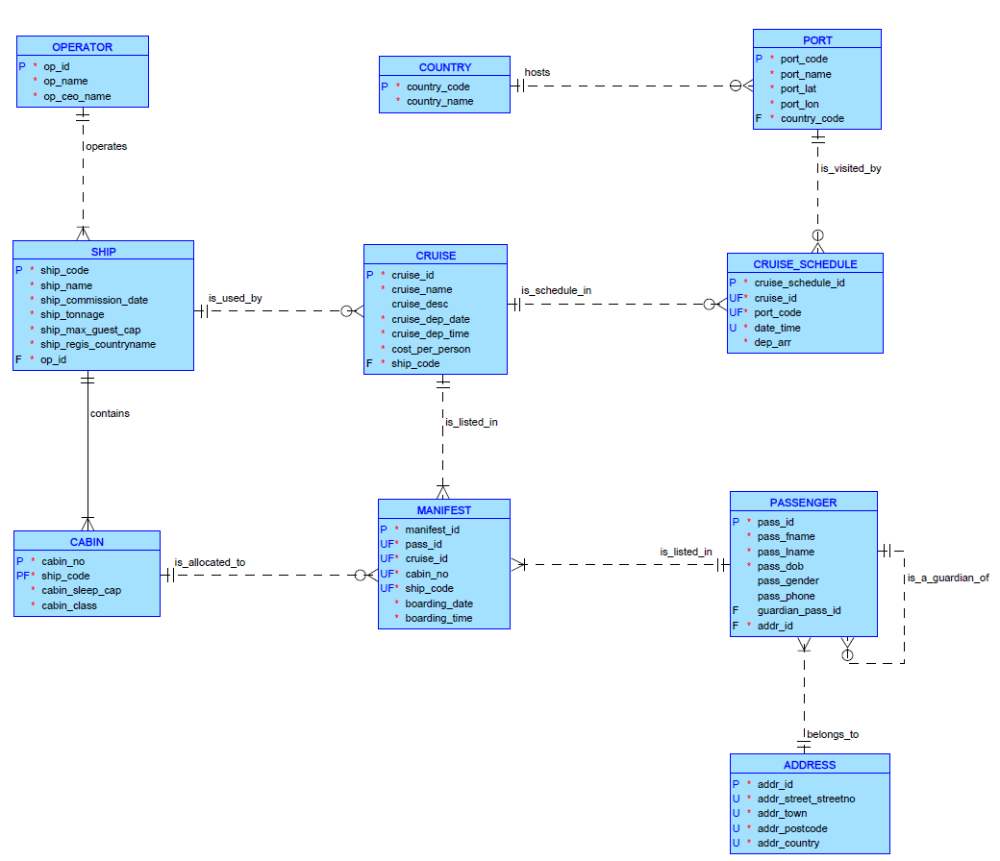

## Overview

This project combines two database coursework projects completed using Oracle SQL. The work covered the database development process from relational design and normalisation to schema implementation, data population, transaction management, SQL reporting queries, and JSON-style output.

The projects were based on business-style case studies: a cruise booking system and the Run Monash running carnival system.

## Project Scope

The work included:

- Designing relational database structures from business requirements.
- Creating conceptual and logical database models.
- Applying normalisation to reduce redundancy and improve data structure.
- Creating tables, primary keys, foreign keys, constraints, and column comments in Oracle SQL.
- Populating tables with valid test data.
- Writing DML statements to insert, update, and delete data safely.
- Modifying an existing database structure while maintaining data integrity.
- Writing SQL reports using joins, aggregation, subqueries, formatting, and date handling.
- Producing JSON-style output from relational tables.


## Database Design

For the database design component, I created conceptual and logical models to represent key business entities, relationships, and constraints. This included identifying primary keys, foreign keys, optional relationships, and business rules.

The design process helped translate business requirements into a structured relational model that supports accurate data storage and reporting.





## Oracle SQL Implementation

For the implementation component, I created and modified database objects in Oracle SQL. This included table creation, constraints, column comments, sample data insertion, and transaction control.

Example table structure:

```sql
CREATE TABLE competitor (
    comp_no        NUMBER(5) NOT NULL,
    comp_fname     VARCHAR2(30),
    comp_lname     VARCHAR2(30),
    comp_gender    CHAR(1) NOT NULL,
    comp_dob       DATE NOT NULL,
    comp_email     VARCHAR2(50) NOT NULL,
    comp_unistatus CHAR(1) NOT NULL,
    comp_phone     CHAR(10) NOT NULL
);
```

This demonstrates how business entities were translated into relational database tables with appropriate data types and constraints.

## Data Population and Transaction Management

I inserted test data to validate the database design and support reporting queries. The data included competitors, event entries, and teams across multiple carnivals.

The work also involved transaction control to ensure related database changes were committed together and managed safely.

## SQL Reporting Queries

I developed SQL queries to answer business reporting requirements, including:

- identifying popular team names across completed carnivals,
- finding record holders for each event type,
- calculating event entry counts and percentages by carnival,
- formatting dates, names, and calculated outputs for readable reports.

Example reporting logic:

```sql
SELECT
    t.team_name,
    TO_CHAR(t.carn_date, 'DD-Mon-YYYY') AS carnival_date,
    c.comp_fname || ' ' || c.comp_lname AS team_leader
FROM team t
JOIN entry e
    ON t.event_id = e.event_id
   AND t.entry_no = e.entry_no
JOIN competitor c
    ON e.comp_no = c.comp_no;
```

This example demonstrates how SQL joins can combine team, entry, and competitor data to produce a readable reporting output.

## JSON and Non-Relational Output

The project also included generating JSON-style output from relational tables. This helped demonstrate how relational data can be reshaped into a nested structure for non-relational use.

Example concept:

```sql
SELECT JSON_OBJECT(
    '_id' VALUE team_id,
    'team_name' VALUE team_name
)
FROM team;
```

This part strengthened my understanding of the difference between relational table structures and document-style data structures.

## Key Takeaway

This project strengthened my practical database skills across the full workflow: database design, Oracle SQL implementation, data manipulation, reporting queries, and preparing relational data for non-relational formats. It also improved my ability to translate business requirements into reliable database structures and useful reporting outputs.
